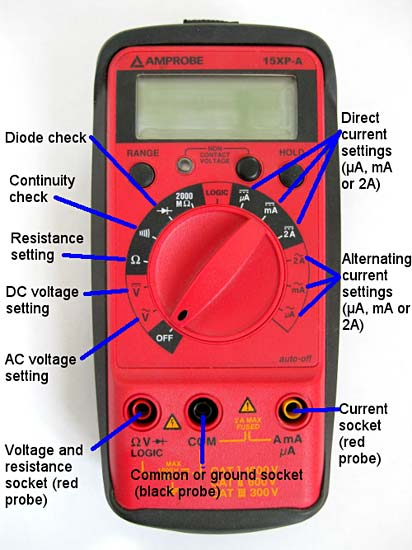

# Introduction and Lab 0

## Introduction

In my point of view, the main purpose for this lab will let you understand how to do experiments systematically. With the understanding of the physics backgrounds, you will see how the physics work in the real world. Then try to use the theory and compare to what you observe in the experiment, and analyze how this theory and observation connect. 

In this labs, EXCEL is powerful tool for you to analyze data. Please try to use functions inside the EXCEL instead of using calculators, since EXCEL will be way powerful than your calculators. 

### Data Analysis with EXCEL

Since we'll use the EXCEL to record our data, we will also be benefit to use the spreadsheet as the calculator or tool for data analysis. 

Here are some examples to use as a calculator: 

* [Microsoft EXCEL tutorial - easy calculation](https://support.office.com/en-us/article/use-excel-as-your-calculator-a1abc057-ed11-443a-a635-68216555ad0a)
* [How to swap the cells \(between x and y axes\) when using scatter plots](https://www.engineerexcel.com/3-ways-update-scatter-chart-excel/)

### Digital Multimeters \(DMM\)

